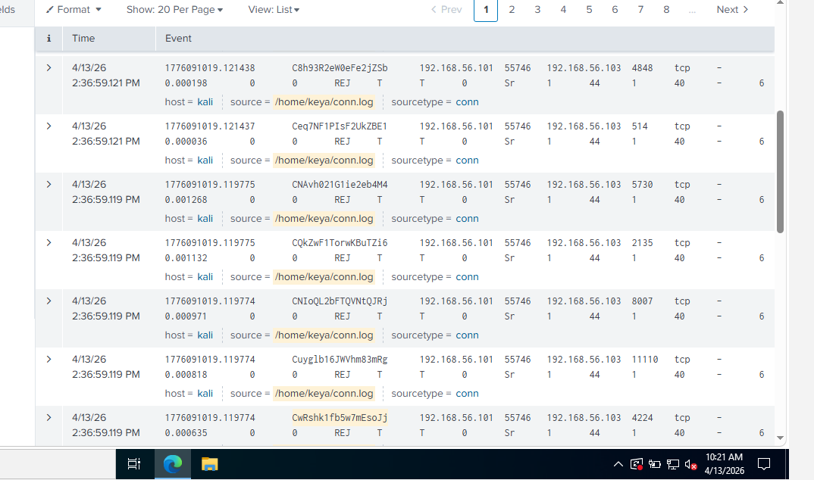

# Soc-lab-zeek-splunk-detection
SOC lab project detecting port scanning attacks using Zeek and Splunk SIEM
# SOC Lab: Threat Detection using Zeek & Splunk

 Project Overview

This project demonstrates a real-world SOC (Security Operations Center) workflow where network traffic is monitored, logs are forwarded, and attacks are detected using SIEM.
 🧩 Architecture

* Ubuntu → Zeek (Network Monitoring)
* Kali Linux → Attacker (Nmap) + Splunk Universal Forwarder
* Windows → Splunk Enterprise (SIEM)

---
⚙️ How the Project Works

1. Zeek captures network traffic and generates logs (conn.log)
2. Kali Linux simulates an attack using Nmap
3. Splunk Universal Forwarder sends logs to Splunk SIEM
4. Splunk analyzes logs and detects suspicious activity

-- Attack Simulation

* Tool used: Nmap
* Command:

```bash
nmap -sS 192.168.56.103
```

* Type: Port Scanning Attack

---
🔍 Detection in Splunk
 Detection & Analysis
 Detection Rule (Splunk)


The following detection rule was created in Splunk to identify potential port scanning activity:

- Detect multiple connection attempts from a single source IP
- Identify abnormal spike in connections using Zeek logs (conn.log)

-- SPL Query

index=zeek sourcetype=conn
| stats count by id.orig_h
| where count > 20

-- Analysis

The query identifies IP addresses generating a high number of connections.

- Attacker IP: 192.168.56.101
- Observation: High number of connection attempts in a short time
- Behavior: Multiple ports scanned across the target system

This pattern is consistent with reconnaissance activity, specifically port scanning.

-- Detection Outcome

--- Detection Outcome

The attack was successfully detected by correlating repeated TCP connection attempts from a single source IP.

The identified behavior clearly indicates port scanning activity originating from 192.168.56.101.
  --📸 Screenshots



---

-- 🛠️ Tools & Technologies

* Zeek
* Splunk Enterprise
* Splunk Universal Forwarder
* Kali Linux
* Nmap
* Ubuntu Linux

---

-  Key Learnings

* Built end-to-end SOC pipeline
* Log analysis using Splunk
* Detection of reconnaissance attacks
* Troubleshooting real-world issues

---

-- Conclusion

Successfully built a SOC lab and detected a port scanning attack using Zeek and Splunk.

