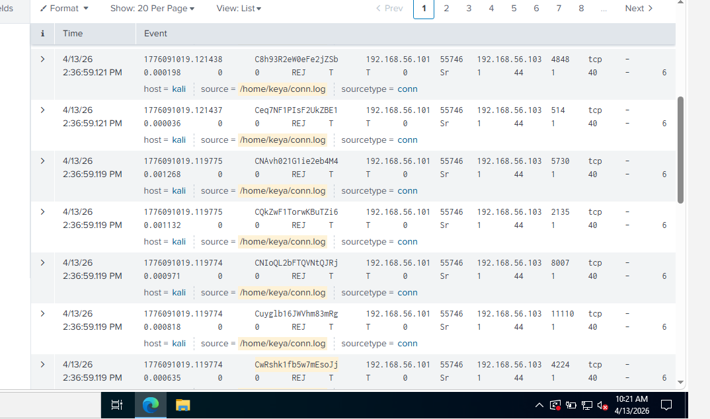

# Soc-lab-zeek-splunk-detection
SOC lab project detecting port scanning attacks using Zeek and Splunk SIEM
# SOC Lab: Threat Detection using Zeek & Splunk

 Project Overview

This project demonstrates a real-world SOC (Security Operations Center) workflow where network traffic is monitored, logs are forwarded, and attacks are detected using SIEM.
 --Architecture

* Ubuntu → Zeek (Network Monitoring)
* Kali Linux → Attacker (Nmap) + Splunk Universal Forwarder
* Windows → Splunk Enterprise (SIEM)

---
⚙️ How the Project Works

1. Zeek captures network traffic and generates logs (conn.log)
2. Kali Linux simulates an attack using Nmap
3. Splunk Universal Forwarder sends logs to Splunk SIEM
4. Splunk analyzes logs and detects suspicious activity

-- Attack Simulation

* Tool used: Nmap
* Command:

```bash
nmap -sS 192.168.56.103
```

* Type: Port Scanning Attack

---
🔍 ## Detection: Port Scan Detection in Splunk

Detecting reconnaissance activity by identifying a single source that probes an abnormal number of destination ports.

### Query

spl
index=main sourcetype=conn NOT "#"
| rex "\S+\t\S+\t(?<src_ip>\S+)\t\S+\t(?<dst_ip>\S+)\t(?<dst_port>\S+)"
| stats dc(dst_port) as distinct_ports by src_ip
| where distinct_ports > 20


**Logic:** the Zeek fields weren't auto-parsed in this Splunk instance, so `rex` extracts the source IP and destination port from the raw log. The query then counts the *distinct destination ports* touched by each source. A port scan's signature is one source probing many different ports — so counting distinct ports (rather than raw connection volume) isolates scanning from normal but busy traffic.

### Result

| src_ip | distinct_ports |

| 192.168.56.101 | 1001 |

The source `192.168.56.101` touched **1001 distinct destination ports** — far beyond any legitimate application behaviour. This is a clear port scan.

### Analysis


- MITRE ATT&CK:T1046 – Network Service Discovery (reconnaissance). The attacker is mapping open services before selecting an exploit.
- Evidence: the source `192.168.56.101` touched 1001 distinct destination ports; all connections show a `REJ` state, meaning the ports were closed and the scan found no open services.
- Threshold: > 20` is a baseline; in production it would be tuned to the environment's normal traffic. At 1001 ports the activity is unambiguous.
- False positives:vulnerability scanners (Nessus, OpenVAS) and asset-discovery tools also touch many ports. Triage confirms whether the source is a sanctioned scanner before escalating.
  Triage steps:confirm the source isn't a sanctioned scanner → note the `REJ` states (scan found no open ports) → determine what was targeted → block and escalate if unsanctioned.

.
  --📸 Screenshots




--- Tools & Technologies

* Zeek
* Splunk Enterprise
* Splunk Universal Forwarder
* Kali Linux
* Nmap
* Ubuntu Linux

## Key Learnings

* Built an end-to-end SOC pipeline: Zeek sensor → log forwarding → Splunk SIEM
* Wrote a detection that counts distinct destination ports per source to isolate scanning from normal traffic
* Extracted fields from raw Zeek logs with `rex` when they weren't auto-parsed
* Mapped the activity to MITRE ATT&CK (T1046 – Network Service Discovery)
* Troubleshot real-world issues: locating data across indexes, correcting the index name, handling raw log parsing


--- Conclusion

Successfully built a SOC lab and detected a port scanning attack using Zeek and Splunk.

